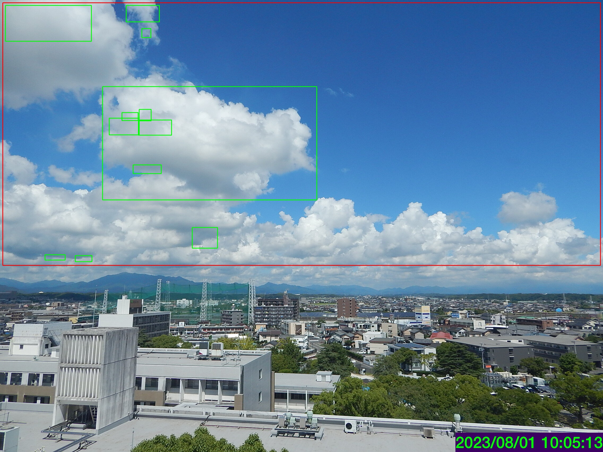

# livcam_cloud_detection
  
気象・気候ダイナミクス研究室が撮影した,鈴鹿山脈を望む定点写真時系列から，
動体検知手法により雲を検出する．

## Dependencies
- OpenCV

## Usage
設定ファイル```config.py```に設定を記述する．
```main.py```を実行する．
```
Python main.py
```
```make_animation.bash```を実行する．
```
bash make_animation.bash
```


## Author
So Tomita
